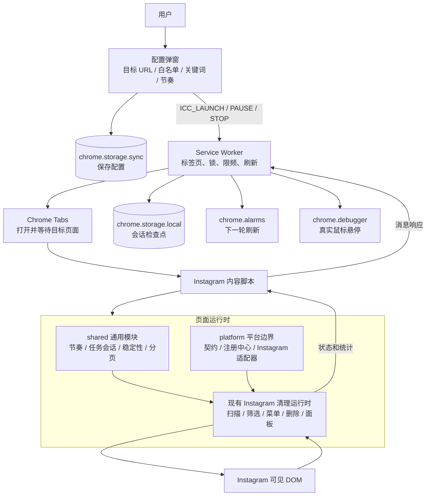

# 社交评论清理器

一个面向 Chrome 的 MV3 扩展，用于在已登录的 Instagram 帖子或 Reels 页面中，按关键词清理符合条件的子级回复。

> 当前版本：`2.0.0` · 当前支持：Instagram · 运行方式：Chrome 扩展
>
> 项目正在进行多平台插件化迁移。当前已经建立平台契约、注册中心和 Instagram 适配层，但实际评论扫描与删除流程仍由现有 Instagram 内容运行时负责。

v2.0.0 的功能更新见 [v2.0.0 更新简述](doc/v2.0.0更新简述.md)。

## 产品特点

- **先预览，再执行**：预览模式只扫描、统计和展示候选，不打开删除菜单，也不会修改页面内容。
- **回复优先，一级评论保护**：只处理已加载的子级回复，一级评论不会被删除。
- **白名单和作者保护**：白名单用户、帖子作者自己的评论和回复始终保留。
- **自动打开目标页面**：从配置页点击开始或预览后，扩展会自动打开并等待目标帖子页面加载。
- **稳定的 DOM 操作**：只使用页面可见 DOM 和 UI，不读取或重放 Instagram 私有接口。
- **可暂停、可停止、可恢复**：任务保存检查点，页面刷新或扩展重启后可以继续未完成会话。
- **悬浮面板不遮挡页面**：进入帖子后默认显示贴在右侧边缘的标签式入口；点击入口展开面板，可最小化、关闭或长按拖到其他屏幕边缘。
- **连续加载与随机节奏**：自动展开可见回复、加载下一批评论，并使用随机等待降低固定操作节奏。
- **限频和异常保护**：全局操作限频、连续处理后休息、会话上限，以及验证、限流、权限异常自动暂停。

## 整体架构



### 运行链路

1. 配置弹窗校验并保存目标 URL、白名单、关键词和节奏参数。
2. Service Worker 查找或打开目标标签页，等待页面完成加载，并发送开始/预览命令。
3. 内容脚本发现稳定的评论区域，展开可见入口，读取评论和回复 DOM，构建父子关系。
4. 通用规则筛选命中关键词的回复，并排除白名单、帖子作者和已经处理过的 ID。
5. 预览模式只更新统计；正式模式重新定位回复、打开菜单、确认删除，并验证节点确实消失。
6. 删除成功后保存检查点；达到连续处理上限时休息，本轮完成后按计划等待刷新并继续。

### 当前插件化状态

阶段 0 已完成：

- `src/platform/contract.js`：标准能力、错误类别和动作结果。
- `src/platform/registry.js`：插件注册、查找和按目标 URL 解析。
- `src/platform/instagram/identity.js`：Instagram `/p/` 和 `/reel/` 地址规范化。
- `src/platform/instagram/plugin.js`：Instagram 插件元数据和迁移占位适配层。

当前仍由以下兼容运行时执行页面行为：

- `src/content/social-comment-cleaner.js`：扫描、线程构建、预览、删除、暂停/停止和页面面板。
- `src/content/rules.js`：关键词、白名单、作者保护和回复候选策略。
- `src/content/comment-pagination-*.js`：评论面发现、加载入口和分页状态。

因此，当前版本已经具备插件化边界，但还没有宣称 Instagram DOM 动作全部迁移到插件目录，也没有接入 TikTok、YouTube 或 Facebook。

## 安装

### 加载源码

1. 使用 Chrome 打开 `chrome://extensions`。
2. 打开右上角的“开发者模式”。
3. 点击“加载已解压的扩展程序”。
4. 选择包含 `manifest.json` 的项目根目录。
5. 将“社交评论清理器”固定到浏览器工具栏。

### 生成 ZIP 安装包

在项目根目录执行：

```bash
npm run package
```

安装包会生成在 `dist/` 目录，文件名类似 `社交评论清理器-v2.0.0.zip`。源码调试仍应使用“加载已解压的扩展程序”。

## 使用方法

### 1. 配置任务

点击工具栏中的扩展图标，在配置弹窗填写：

- **目标帖子 URL**：Instagram 帖子或 Reels 的完整地址，例如 `https://www.instagram.com/p/shortcode/`。
- **白名单用户名**：每行一个用户名，可带 `@`，比较时不区分大小写。
- **删除关键词**：每行一个普通文本关键词，回复文本包含任意关键词时进入候选。

目标地址只接受 Instagram 的 `/p/` 或 `/reel/` 路径；查询参数、哈希和末尾斜杠会自动规范化。

### 2. 先运行预览

点击“预览模式”。扩展会打开目标页面并扫描当前可见评论，自动展开和加载下一批，显示一级评论、回复、命中和跳过统计。

预览不会：

- 打开评论删除菜单；
- 点击删除或确认按钮；
- 进入长期自动刷新循环。

### 3. 确认后开始清理

确认预览结果后点击“开始”。正式运行会：

- 只处理命中关键词的子级回复；
- 每次动作前等待并重新定位节点；
- 删除后等待页面稳定并验证删除结果；
- 连续成功处理 20 条后随机休息；
- 本轮完成后等待 10～60 分钟，绕过页面缓存刷新并继续。

运行中可以点击“暂停”保存进度，之后再次点击“开始”恢复；点击“停止”会清除当前会话，不再自动刷新或恢复。

### 4. 使用悬浮面板

- 页面加载后只显示贴在右侧边缘的标签式入口，点击入口才会展开完整控制面板。
- 标题栏的“—”只最小化面板，不会暂停任务；再次点击标签入口可继续查看状态。
- 长按标签入口约半秒并拖动，松开后会吸附到最近的屏幕边缘；短按仍然是打开面板。
- 空闲时点击标签入口旁的“×”或标题栏“×”会立即移除当前页面控件。任务运行中会先弹出确认，选择“关闭并暂停”后保存进度再移除控件，选择“取消”则继续运行。
- 关闭只影响当前标签页；刷新页面后仍保持关闭，只有再次点击配置页的“开始”或“预览模式”才会重新打开，其他标签页不会继承关闭状态。

## 默认策略

| 项目 | 默认值 | 作用 |
| --- | ---: | --- |
| 删除操作间隔 | 平均 18 秒，最短 12 秒，最长 30 秒 | 两次删除之间的随机等待 |
| 删除前等待 | 平均 20 秒，最短 5 秒，最长 25 秒 | 删除菜单出现后再点击删除前的等待 |
| 连续处理上限 | 20 条 | 达到后进入休息 |
| 连续处理后休息 | 平均 60 秒，最短 45 秒，最长 90 秒 | 避免长时间连续操作 |
| 本次删除上限 | 100 条 | 也可以选择“不限”，但仍受限频和异常保护约束 |
| 本轮完成后续跑 | 平均 30 分钟，范围 10～60 分钟 | 刷新页面并继续下一轮 |
| 全局限频 | 每分钟 5 次，每小时 60 次 | 所有 Instagram 标签页共用 |
| 自动加载 | 始终开启 | 自动滚动或点击可见加载入口 |

## 安全边界

- 未填写关键词时只扫描，不会执行删除。
- 一级评论永远不会删除，回复先于父级处理。
- 白名单和帖子作者保护优先于关键词匹配。
- 评论区、菜单、删除项或确认结果无法唯一确认时暂停。
- 检测到验证、挑战、限流、权限不足或页面结构异常时暂停。
- 同一目标帖子同时只能有一个运行会话。
- 不要求用户提供 Instagram 密码，不上传账号信息，不调用私有接口。
- 真实使用建议先用测试账号、小批量和预览模式验证。

## 项目结构

```text
social-comment-cleaner/
├── manifest.json                         # Chrome MV3 清单和权限
├── src/
│   ├── background/service-worker.js      # 标签页、锁、限频、刷新和消息路由
│   ├── options/                          # 配置弹窗和参数校验
│   ├── platform/
│   │   ├── contract.js                   # 平台插件契约
│   │   ├── registry.js                   # 插件注册中心
│   │   └── instagram/                    # Instagram 平台适配层（迁移中）
│   ├── shared/                           # 节奏、会话、退避、限频和分页工具
│   └── content/                          # 当前页面扫描、解析、删除和悬浮面板运行时
│       └── floating-panel-state.js       # 面板状态、长按拖动和边缘吸附纯逻辑
├── test/                                 # Node.js 单元测试和契约测试
├── doc/                                  # 架构方案和技术记录
└── scripts/package-extension.mjs         # ZIP 打包脚本
```

## 开发与验证

```bash
npm test
node --check src/platform/contract.js
git diff --check
```

当前测试覆盖节奏、限频、任务会话、分页稳定性、候选保护、DOM-only 约束和平台插件契约。浏览器真实删除行为仍需使用测试账号和小批量内容验证，静态测试不等同于真实平台验收。

## 后续路线

1. 将 Instagram URL、评论解析和页面状态进一步迁移到 `platform/instagram/`。
2. 将现有内容脚本拆分为通用 `TaskSession`、`CleanerRuntime`、等待协调和 UI 快照。
3. 统一后台消息、配置结构和平台能力声明。
4. 选择第二个平台进行插件试点，不复制通用运行时。

详细边界和迁移顺序见：[社交评论清理器多平台插件化解耦合重构方案](doc/社交评论清理器多平台插件化解耦合重构方案.md)。

## 免责声明

本工具只应处理用户本人有权管理的内容。Instagram 页面结构、账号权限和平台规则可能变化；遇到验证、限流或页面异常时，应停止操作并按平台提示处理。
